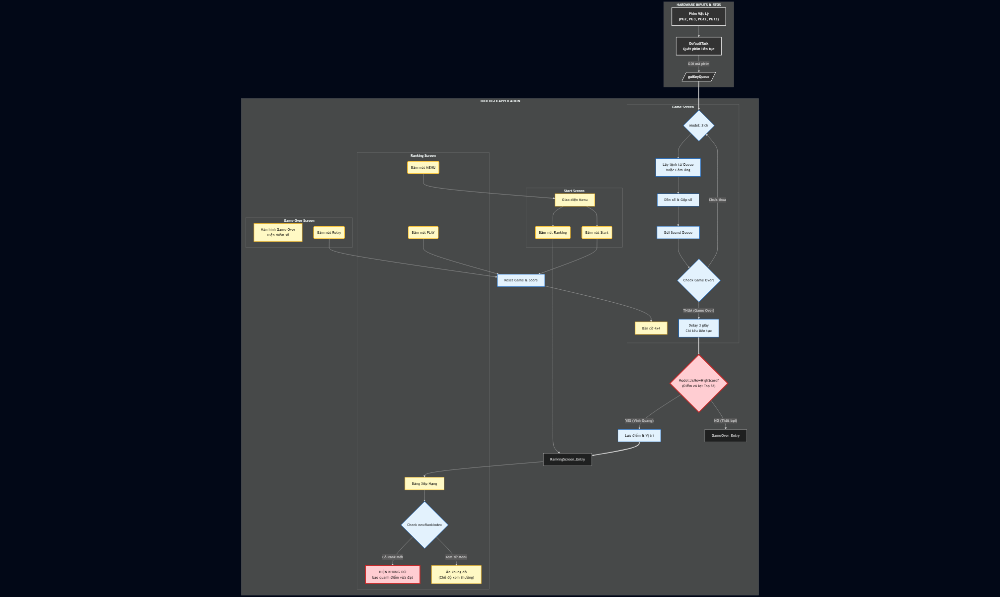

# Báo cáo Project: 2048 Game trên STM32F429ZIT6

## 1. Tên Project và Mô tả nội dung

**Tên Project:** 2048 Game STM32

**Mô tả:**
Dự án này là một bản triển khai của trò chơi giải đố trí tuệ nổi tiếng "2048" trên nền tảng hệ thống nhúng. Trò chơi chạy trên kit phát triển STM32F429ZIT6, sử dụng màn hình cảm ứng và bàn phím 4 nút để tương tác.

Mục tiêu của trò chơi là trượt các ô vuông có đánh số trên một lưới 4x4 để kết hợp chúng lại. Khi hai ô có cùng số chạm nhau, chúng sẽ hợp nhất thành một ô có giá trị bằng tổng hai ô đó (ví dụ: 2+2=4, 4+4=8). Người chơi cố gắng đạt số điểm cao nhất có thể.

## 2. Thiết kế phần cứng

Hệ thống được xây dựng dựa trên:

* Bộ kit STM32F429ZIT6.
* Bàn phím 4 nút.
* Còi buzzer.

Sơ đồ mạch như sau:

* PC1: Chân dương của còi.
* GND: Chân âm của còi.
* PG2: Nút Up (dây đỏ).
* PG3: Nút Down (dây vàng).
* PG13: Nút Left (dây xanh lam).
* PG14: Nút Right (dây xanh lá).

## 3. Thiết kế phần mềm

Phần mềm được phát triển sử dụng **TouchGFX** framework, tuân theo kiến trúc **Model-View-Presenter (MVP)** để tách biệt logic xử lý và giao diện.

### Công cụ phát triển

* **STM32CubeIDE:** Môi trường lập trình.
* **TouchGFX Designer:** Thiết kế giao diện người dùng (GUI).

### Kiến trúc chi tiết

1. **Model (Logic Game):**
    * Quản lý mảng 2 chiều (4x4) đại diện cho bàn cờ.
    * Thực hiện thuật toán di chuyển và gộp số (Move & Merge algorithm).
    * Sinh số ngẫu nhiên (2 hoặc 4) tại các vị trí trống sau mỗi lượt đi.
    * Kiểm tra điều kiện thua (không còn nước đi).
    * Quản lý điểm số, bảng xếp hạng.
    * Nhận điều khiển từ người dùng.
    * Kich hoạt các hiệu ứng âm thanh.

2. **View (Giao diện):**
    * Hiển thị lưới (Grid) và các ô số (Tiles) lên màn hình.
    * Xử lý hiệu ứng chuyển động (Animation) khi các ô di chuyển.
    * Xử lý hiệu ứng chuyển màn hình (Screen).
    * Bắt sự kiện nhấn nút trên màn hình.

3. **Presenter (Điều phối):**
    * Nhận tín hiệu input từ View (người dùng nhấn nút), gửi yêu cầu xử lý xuống Model.
    * Nhận trạng thái mới từ Model (điểm số, vị trí các ô), yêu cầu View cập nhật lại màn hình.

4. **Backend Module (Giao tiếp với phần cứng):**
    * Phát hiện người dùng bấm nút điều khiển và gửi thông báo tới Model.
    * Kích hoạt còi buzzer theo yêu cầu từ Model.

### Sơ đồ hoạt động

## Danh sách thành viên

* Trần Đức Chính.
* Hà Minh Hiếu.
* Nguyễn Thanh Tuyển.

Nhóm tổ chức các buổi làm việc chung, cùng thảo luận, đóng góp ý kiến, thiết kế và lập trình để hiểu và nắm rõ toàn bộ project nên không có phân chia việc nhỏ cho từng người.

Do đó mức đóng góp của 3 thành viên trong nhóm là tương đương nhau.

## Video demo

[Video demo](https://drive.google.com/file/d/1r8os2e4euMG9XuZoSZkQyrqjmsDVn-cx/view?usp=sharing)
